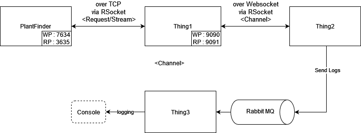

# Introduction

This tutorial refers to Mark Heckler's [vedio](https://www.youtube.com/watch?v=WJuMkgxDyEA&list=LL&index=2) about introducing the RSocket in transporting data. Mark Heckler is architect, developer and the author of `Spring Boot Up & Running`.

In my project, I just practiced by following Mark Heckler's instructions to clearly understand how the RSocket works and run in my local environment. I drawed the system architecture diagram based on the vedio illustration as below to know where we are and how services to communicate with each other.



All above service source code could be found in [Mark Heckler's github](https://github.com/mkheck/warpspeed).

Specific Term Explaination in the Diagram :
- **WP** : Web server port
- **RP** : RSocket port (yes, we have to give a specific port for RSocket to transport data)

There are two RSocket intraction modes used in this case. Give a short introduction.
- **Request/Stream** : one request and multiple response pattern.
- **Channel** : a bidirection communication channel.

RSocket also has other intraction modes (**Fire and Forget** and **Request/Response**). More details refer to [RSocket - Interaction Models](https://rsocket.io/about/motivations#interaction-models)

# Launch

## Message Queue
Launch the RabbitMQ
```shell
docker run -d --hostname my-rabbit --name my-rabbit -p 5672:5672 -p 15672:15672 rabbitmq:3-management
```

## Launch Services

1. Launch planefinder
```shell
cd planefinder
mvn spring-boot:run
```

logging :
```shell
...
2022-05-01 22:40:48.987  INFO 5888 --- [           main] o.s.b.web.embedded.netty.NettyWebServer  : Netty started on port 7634
2022-05-01 22:40:48.999  INFO 5888 --- [           main] o.s.b.rsocket.netty.NettyRSocketServer   : Netty RSocket started on port(s): 7635
```
Test fetch data
```shell
curl --location --request GET 'http://127.0.0.1:7634/aircraft'
```
Response
```json
[
    {
        "id": 1,
        "callsign": "SAL179",
        "squawk": "sqwk",
        "reg": "N02968"
        ...
    }
]
```


2. Launch thing1
```shell
cd thing1
mvn spring-boot:run
```

logging :
```shell
...
2022-05-01 22:40:48.987  INFO 5888 --- [           main] o.s.b.web.embedded.netty.NettyWebServer  : Netty started on port 9090
2022-05-01 22:40:48.999  INFO 5888 --- [           main] o.s.b.rsocket.netty.NettyRSocketServer   : Netty RSocket started on port(s): 9091
```

3. Launch thing2
```shell
cd thing2
mvn spring-boot:run
```

logging :
```shell
...
2022-05-01 23:54:13.430  INFO 3480 --- [actor-tcp-nio-2] reactor.Flux.Map.1                       : onNext(Aircraft(callsign=SAL417, reg=N02174, flightno=SAL417, type=PA28, altitude=14004, heading=237, speed=308, lat=35.5634765625, lon=-83.71095275878906))
aircraft:Aircraft(callsign=SAL417, reg=N02174, flightno=SAL417, type=PA28, altitude=14004, heading=237, speed=308, lat=35.5634765625, lon=-83.71095275878906)
```
As we can see, the **thing2** can fetch data from **thing1** over Websocket via RSocket.

4. Launch thing3
```shell
cd thing3
mvn spring-boot:run
```

logging :
```shell
...
log : Aircraft(callsign=SAL241, reg=N08537, flightno=SAL241, type=E75L, altitude=15705, heading=155, speed=274, lat=38.789188385009766, lon=-98.48175048828125)
```
Because the **thing2** will send log message to RabbitMQ, and the **thing3** listens to the queue to show the messages.


